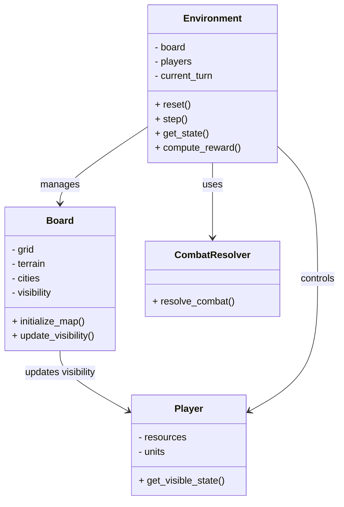

```mermaid
classDiagram
    class Board {
        - grid
        - terrain
        - cities
        - visibility
        + initialize_map()
        + update_visibility()
    }

    class Player {
        - resources
        - units
        + get_visible_state()
    }

    class Environment {
        - board
        - players
        - current_turn
        + reset()
        + step()
        + get_state()
        + compute_reward()
    }

    class CombatResolver {
        + resolve_combat()
    }

    Board --> Player : updates visibility
    Environment --> Board : manages
    Environment --> Player : controls
    Environment --> CombatResolver : uses
```
